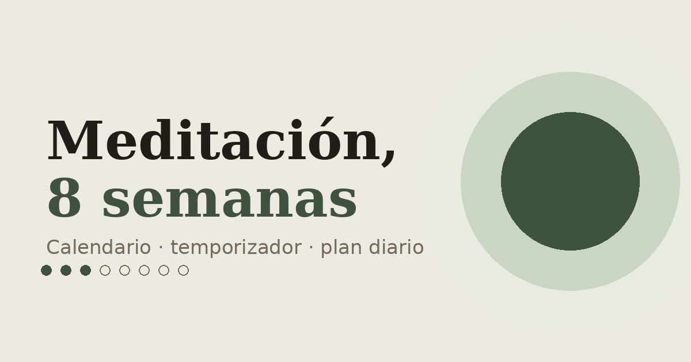

# Meditación, 8 semanas

A minimalist app for building a daily meditation habit: a tracking calendar, a timer with a bell, a progressive 8-week plan, and a short guide on how to meditate.

**Live demo:** [8semanas.vercel.app](https://8semanas.vercel.app)

No backend, no database, no build step. It's a single `index.html` file that runs in any browser and saves progress to `localStorage`.

---

## What it does

- **Monthly calendar** where each day gets marked automatically or by hand, with navigation between months.
- **Timer** with presets from 5 to 20 minutes, a start/end bell synthesized with the Web Audio API (no audio files involved), and a breathing-circle animation while a session runs.
- **8-week plan** that ramps up daily minutes gradually and holds for a week here and there to let the habit settle before the next jump. The plan isn't static: the app figures out which week you're on based on how many days you've actually completed, and starts each session at the recommended duration for that week.
- **Streak counter**, reinforcing the method's core idea: every day beats one long session a week.
- **"Learn to meditate" guide**: posture, what to do when your mind wanders, common beginner mistakes, and FAQ.
- No account, no login, no tracking. Everything lives in the user's own browser.

## How it was built

This started in **Google AI Studio** (Gemini): that's where I built the first version as a React + TypeScript + Vite project, with the calendar and the plan as two separate blocks. When that session ran out of tokens, I moved to **Claude** to redesign it from scratch and add what was missing — the timer with the bell, a real progress bar (calculated from saved sessions, not from the calendar date), the streak, and the meditation guide.

The most consequential decision was technical: instead of keeping the original Vite project, I converted it into **a single HTML file with no build step**. The reasoning was simple — I wanted to be able to drop this onto GitHub Pages or Vercel by dragging one file in, with no `npm install`, no pipeline, and no risk of a dependency bump quietly breaking the deploy two years from now. React, ReactDOM, and Babel Standalone load from a CDN, and Babel transpiles the JSX in the browser at page load.

The "Learn to meditate" content was written after reviewing several beginner meditation guides (Mayo Clinic, Insight Timer, among others) to make sure the technique and common mistakes described actually match what shows up consistently in that literature — but it's written from scratch, not copied from any source.

## Tech stack

- **React 18** (UMD build, via CDN) — no precompiled JSX
- **Babel Standalone** — transpiles JSX in the browser at page load
- **Web Audio API** — generates the start/end bell with oscillators, no `.mp3` files
- **`localStorage`** — progress persistence, per browser
- **CSS variables + inline styles** — no Tailwind, no CSS framework
- **Google Fonts** — Fraunces (serif, for headings and numbers) + Inter (sans, for everything else)
- Zero `npm` dependencies, zero build step

## Design decisions

I wanted to avoid the generic "AI-generated SaaS" look — cream background plus terracotta accent, or identical cards with the same border-radius on everything. The palette ended up being paper + moss green + a muted violet for "current" states, meant to feel more like a habit journal than a dashboard.

Two specific choices worth calling out:

- The **8-week plan is shown as a stepping-stone path** (numbered circles connected by a line) instead of a list of cards — the path metaphor fits a habit that gets built week by week better than a data table would.
- The **timer is a circle that breathes** (expanding and contracting on an 8-second cycle while it runs) instead of just showing a number — a small touch, but one that ties the interface to what you're actually doing while looking at it.

## Project structure

```
├── index.html              The whole app: HTML, CSS, and JS in one file
├── og-image.png             Preview image shown when the link is shared
├── apple-touch-icon.png     Icon for adding the site to an iOS home screen
└── README.md
```

## Running or deploying this

No build, no `npm install`. Just open `index.html` in a browser to try it locally.

To publish it:

**GitHub Pages**
1. Push all three files (`index.html`, `og-image.png`, `apple-touch-icon.png`) to the root of the repo.
2. `Settings → Pages → Source`, pick the `main` branch and the `/root` folder.
3. GitHub gives you a URL within a minute or two.

**Vercel**
Import the repo as-is — with no `package.json`, Vercel serves it as a static site with no extra configuration.

If the domain ever changes, three lines in `index.html`'s `<head>` need updating: `<link rel="canonical">`, `<meta property="og:url">`, and `<meta property="og:image">` — they currently point to `https://8semanas.vercel.app`.

## Ideas for later

- Export/import progress as JSON, so it survives a browser switch
- Dark mode
- A daily reminder (via Service Worker) instead of relying on memory alone

## License

MIT — use it, fork it, break it, whatever you want.

## Author

Built by **[Mapa Bianchi](https://www.linkedin.com/in/mapabianchi/)** — vibecoding.
More projects at [mapabianchi.online](https://mapabianchi.online).
